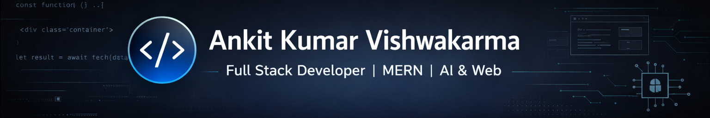

# 👋 Hello, I'm Ankit Kumar Vishwakarma

🎓 MCA Student | 🚀 Full Stack Developer | 🧠 AI & Web Enthusiast  

---

## 🔥 About Me

I am a passionate **Full Stack Developer** who loves building scalable, real-world web applications using modern technologies.  
I focus on **clean UI**, **secure backend systems**, and **performance-optimized solutions**.

- 💻 **Tech Stack:** React, Node.js, Express, MongoDB, Next.js, Firebase, Tailwind CSS  
- 🧰 **Tools:** GitHub, Vercel, Docker, Postman, VS Code  
- 🌱 **Currently Learning:** WebSockets, GraphQL  
- 🎯 **Goal:** Build production-ready applications and grow as a software engineer  

---

## 🛠️ Tech Stack

---

## 🚀 Featured Projects

🔹 **GreenBasket – Grocery Website**  
Full-stack MERN application with authentication, cart, orders & admin panel.  

🔹 **Audio Recorder App**  
Live voice recording with download support using Node.js, MongoDB & Cloudinary.  

🔹 **College Campus Placement & Interview Prep**  
AI-assisted interview preparation platform built with Next.js & Firebase.  

🔹 **E-commerce UI**  
Modern, responsive UI concept for a fashion e-commerce website.

---

## 📊 GitHub Stats

---

## 🐍 Contribution Snake

---

## 🔗 Let's Connect

---

⭐ **If you like my work, consider giving a star to my repositories!**
